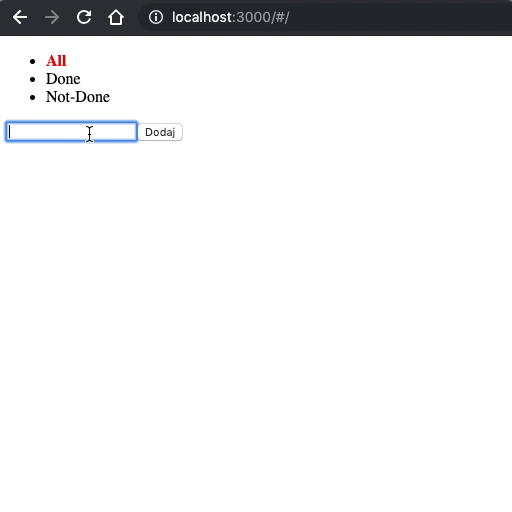

# Kilka ważnych informacji

Przed przystąpieniem do rozwiązywania zadań przeczytaj poniższe wskazówki

## Jak zacząć?

1. Stwórz [*fork*](https://guides.github.com/activities/forking/) repozytorium z zadaniami.
2. Sklonuj fork repozytorium (stworzony w punkcie 1) na swój komputer. Użyj do tego komendy `git clone adres_repozytorium`
Adres możesz znaleźć na stronie forka repozytorium po naciśnięciu w guzik "Clone or download".
3. Rozwiąż zadania i skomituj zmiany do swojego repozytorium. Użyj do tego komend `git add nazwa_pliku`.
Jeżeli chcesz dodać wszystkie zmienione pliki użyj `git add .` 
Pamiętaj że kropka na końcu jest ważna!
Następnie skommituj zmiany komendą `git commit -m "nazwa_commita"`
4. Wypchnij zmiany do swojego repozytorium na GitHubie.  Użyj do tego komendy `git push origin master`
5. Stwórz [*pull request*](https://help.github.com/articles/creating-a-pull-request) do oryginalnego repozytorium, gdy skończysz wszystkie zadania.

Poszczególne zadania rozwiązuj w odpowiednich plikach.

### Poszczególne zadania rozwiązuj w odpowiednich plikach.

**Repozytorium z ćwiczeniami zostanie usunięte 2 tygodnie po zakończeniu kursu. Spowoduje to też usunięcie wszystkich forków, które są zrobione z tego repozytorium.**


## Przygotowanie

> W głównym katalogu repozytorium uruchom komendę `npm install` aby zainstalować wszystkie niezbędne zależności. Wszystkie zależności potrzebne do wykonania egzaminu są wprowadzone do pliku `package.json` dlatego wytarczy uruchomić komendę `npm install`.
>
> Plik `webpack.config.js` też został już przygotowany do specyfiki tego egzaminu. Nie ma potrzeby jego edytowania.
>
> Aby uruchomić projekt, należy po instalacji, wpisać w terminalu `npm start`. Projekt uruchomi serwer deweloperski.
>
> **UWAGA!** Jeżeli podczas uruchomienia komendy `npm start` pojawi się komunikat: `Error: listen EADDRINUSE: address already in use`, należy zmienić wartość klucza `port` w pliku `webpack.config.js`, np. na `3002` i uruchomić serwer ponownie (`npm start`). Wtedy będzie osiągalny pod adresem: `http://localhost:3002`.

---

## Efekt końcowy



---

## Zadanie 1 - Routing

W pliku `components/Main.js` zaimplementuj prosty routing. Powinien składać się z jednej ścieżki `/`, która może przyjąć opcjonalny parametr o nazwie `filter`.

Ścieżka ta powinna renderować komponent `Main` z katalogu `components`.

Szkielet aplikacji powinien renderować 3 linki:

- `/` - z napisem "All"
- `/done` - z napisem "Done"
- `/not-done` - z napisem "Not-Done"

Aktywny link powinien mieć:

- czerwony kolor czcionki (`red`)
- pogrubienie (`bold`)

W razie błędnej ścieżki np. `/to/nie/jest/poprawna/ścieżka` wyrenderuj komponent `NotFound` z katalogu `components`.

Komponent `NotFound` powinien renderować: `<h1>404 - nie znaleziono strony</h1>`.


## Zadanie 2 - Dodawanie nowego ToDo

W pliku `redux/reducer.js` zaimplementuj reducer `todos`. Jego stanem początkowym ma być pusta tablica `[]`.

Tablica przechowuje elementy ToDo w postaci:

```JavaScript
{
  title: "Nazwa elementu",  // nazwa elementu
  done: false               // flaga oznaczająca czy element został wykonany, na początku ustawiona na false
}
```

Na początku powinien reagować na akcję `ADD_TODO`. Stałą do tej akcji zaimplementuj w pliku `redux/actions.js`.
Oprócz stałej, zaimplementuj także action-creator o nazwie `add`. Funkcja ta powinna przyjmować w argumencie nazwę elementu ToDo i przypisać ją do pola `payload` akcji.

Utwórz komponenty `Form` w katalogach `components` (prezentacyjny) oraz `containers` (kontenerowy).

Komponent ten powinien składać się z:

- `<input>`, w którym można wpisać nazwę elementu ToDo
- `<button>`, z napisem "Dodaj". Po jego kliknięciu wpisany ToDo item zostaje dopisany do stanu aplikacji.

Struktura komponentu:

```html
<form>
  <input type="text" id="todoName" name="todoName" />
  <button type="submit">Dodaj</button>
</form>
```

Wyrenderuj kontener `Form` w komponencie `Main`.


## Zadanie 3 - Wyświetlanie listy ToDo

Utwórz komponenty `List` w katalogach `components` (prezentacyjny) oraz `containers` (kontenerowy).

Komponent ten powinien wyświetlać listę ToDo itemów w postaci listy HTML:

```html
<ul>
  <li><span>Nazwa itemu</span></li>
</ul>
```

Lista powinna być dynamiczna, a jej elementy powinny pochodzić ze stanu aplikacji.

Wyrenderuj kontener `List` w komponencie `Main`.


## Zadanie 4 - Oznaczanie ToDo jako zrobiony

Do pliku z akcjami dopisz akcję `TODO_TOGGLED` wraz z action-creatorem `toggle`, który powinien przyjmować nazwę elementu ToDo do oznaczenia i przypisze go do pola `payload`.

Zareaguj na akcję `TODO_TOGGLED` w reducerze - ustaw element jako wykonany/niewykonany.

Akcja `toggle` powinna zostać wykonana w momencie kliknięcia na element `<span>` zawierający nazwę elementu ToDo.

Wykonany element powinien zostać przekreślony na liście (css: `text-decoration: line-through`). Stylowanie dodaj za pomocą obiektu `style`.


## Zadanie 5 - Usuwanie ToDo

Do pliku z akcjami dopisz akcję `TODO_REMOVED` wraz z action-creatorem `remove`, który powinien przyjmować nazwę elementu ToDo do usunięcia i przypisze go do pola `payload`.

Zareaguj na akcję `TODO_REMOVED` w reducerze - usuń element z listy.

Do każdego elementu z listy dodaj przycisk "Usuń". Po jego kliknięciu, dany element powinien zostać usunięty z listy.

```html
<ul>
  <li>
    <span>Nazwa itemu</span>
    <button>Usuń</button>
  </li>
</ul>
```


## Zadanie 6 - Filtrowanie ToDo na podsawie routingu

Po kliknięciu w linki, stworzone w zadaniu 1, lista powinna zawierać odflitrowane elementy:

- `/` - All - wszystkie elementy są widoczne
- `/done` - Done - widoczne są tylko "zrobione" elementy (te przekreślone)
- `/not-done` - Not-Done - widoczne są niezrobione elementy


## Zadanie 7 - Usuwanie ToDo asynchronicznie po 2 sekundach

Do elementu listy dodaj nowy przycisk "Usuń po 2s". Jego kliknięcie powinno spowodować asynchroniczne usunięcie elementu po 2 sekundach.
